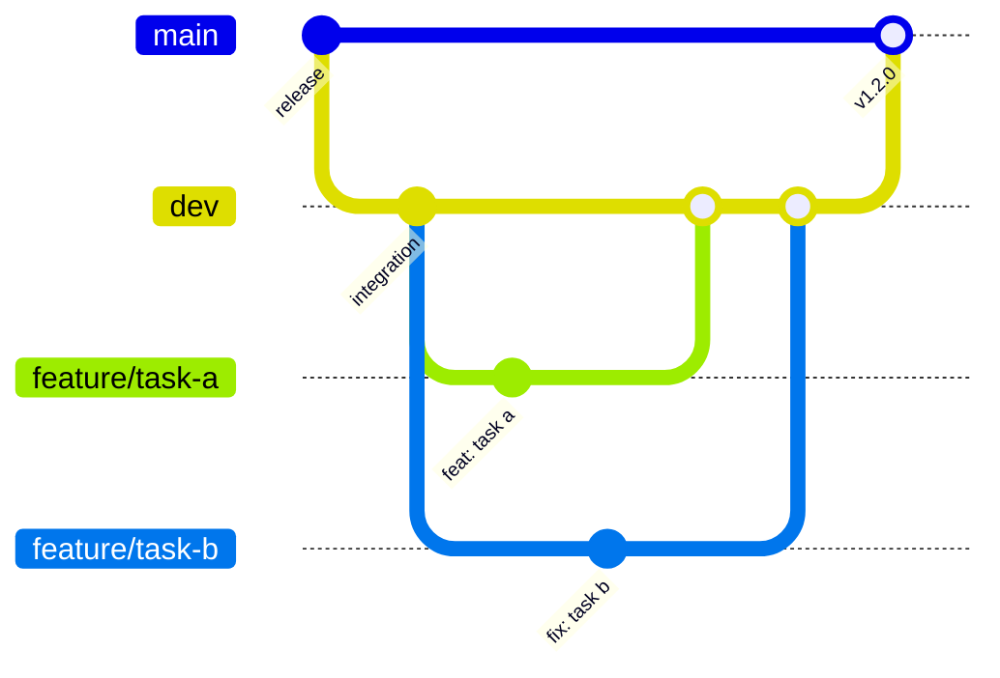

# Contributing to Wildlife.ai 🌿

Kia ora! Thank you for joining our mission to accelerate conservation through AI. 

Whether you're here to squash (software) bugs, improve documentation, or build new features, we just ask that you follow our Wildlines below.

Thanks for helping us keep the world wild!🦤🦎🐅🌳🐠

## 📋 Table of Contents
 
1. [Core Principles](#1-core-principles)
1. [Branching Strategy](#2-branching-strategy)
1. [Standard Workflow](#3-standard-workflow)
   - [3.1 Start a New Task](#31-start-a-new-task)
   - [3.2 Do Your Work — Commit Often](#32-do-your-work--commit-often)
   - [3.3 Before Pushing — Rebase onto dev](#33-before-pushing--rebase-onto-dev)
   - [3.4 Push Your Branch](#34-push-your-branch)
   - [3.5 Create a Pull Request](#35-create-a-pull-request)
   - [3.6 Code Review](#36-code-review)
1. [Switching Tasks (Staggered Development)](#4-switching-tasks-staggered-development)
1. [Post-Merge Cleanup](#5-post-merge-cleanup)
1. [Repository Protections (Admins Only)](#6-repository-protections-admins-only)
1. [Quick Reference Cheat-sheet](#7-quick-reference-cheat-sheet)
1. [AI Usage and Agents](#8-ai-usage-and-agents)
 
---
 
## 1. Core Principles 
 
1. **Linear History:** We rebase; we don't merge bubbles.
2. **Review Everything:** No code lands in `dev` without a second pair of eyes (Gemini + Human).
3. **Default to `dev`:** `main` is for stable releases only.
 
---
 
## 2. Branching Strategy
 

 
| Branch | Purpose | Direct commits? |
| :--- | :--- | :--- |
| `main` | Stable production releases | **Never** — only merged from `dev` via PR |
| `dev` | Integration branch — the base for all work | **Never** — only merged from feature branches via PR |
| `feature/*` | Individual task, fix, or experiment | **Yes** |
 
> [!IMPORTANT]
> All work starts and ends with `dev`. Never commit directly to `dev` or `main`.
 
### 2.1 Branch Naming
 
Use a short, descriptive name with one of the following prefixes:
 
| Prefix | Use for |
| :--- | :--- |
| `feature/` | New functionality (e.g. `feature/add-lora-retry`) |
| `fix/` | Bug fixes (e.g. `fix/ble-timeout`) |
| `docs/` | Documentation only (e.g. `docs/update-contributing`) |
| `chore/` | Maintenance, deps, config (e.g. `chore/update-deps`) |
| `refactor/` | Code restructure with no behaviour change |
 
**Stacked branches — use a sequence number.** If you are building a chain of dependent branches, add a two-digit sequence number so the order is always unambiguous, both to you and to reviewers:
 
```
feature/01-ble-init
feature/02-ble-send
feature/03-ble-retry
```
 
This makes it immediately clear which branch depends on which, and prevents confusion when multiple PRs are open at the same time.
 
---
 
## 3. Standard Workflow
 
### 3.1 Start a New Task
 
Always branch from the latest `dev` to ensure you are building on the most recent work:
 
```bash
git checkout dev
git pull origin dev
git checkout -b feature/your-descriptive-name
```
 
---
 
### 3.2 Do Your Work — Commit Often
 
Make small, focused commits as you work. We use [Conventional Commits](https://www.conventionalcommits.org/) to help automate release notes.
 
**Format:** `<type>: <short description>`
 
```bash
git add -A
git commit -m "fix: add retry logic for BLE command timeout"
```
 
Common types: `feat`, `fix`, `docs`, `chore`, `refactor`, `test`
 
Write commit messages that explain **what changed and why**, not just what the code does.
> [!WARNING]
> **Commit Body Length:** Ensure that any extended description (the body) of your commit messages hard-wraps at **100 characters maximum per line**. If a single line in the body exceeds 100 characters, the `commitlint` CI check will fail.
 
> [!TIP]
> **Commit signing:** If your repo requires signed commits, ensure it's configured:
> ```bash
> git config commit.gpgsign true
> ```
 
---
 
### 3.3 Before Pushing — Rebase onto `dev`
 
Before you push (or create a PR), rebase your branch onto the latest `dev` to keep a linear history and avoid messy "merge bubbles."
 
```bash
git fetch origin
git rebase origin/dev
```
 
**If there are conflicts,** Git will pause and let you resolve them file by file:
 
```bash
# After resolving each conflict:
git add <resolved-file>
git rebase --continue
 
# To abort and return to your previous state:
git rebase --abort
```
 
> [!TIP]
> **Why rebase instead of merge?** Rebasing rewrites your commits on top of the latest `dev`, so your work appears sequentially after the latest changes — producing a clean, readable history with no merge commits.
 
---
 
### 3.4 Push Your Branch
 
**If this branch has never been pushed to GitHub before**, Git doesn't yet know where to send it. You must set the upstream remote the first time:
 
```bash
# First push — sets the upstream tracking branch on GitHub
git push --set-upstream origin feature/your-descriptive-name
# Shorthand: git push -u origin feature/your-descriptive-name
```
 
After that first push, Git remembers the link. For all subsequent pushes (including after a rebase):
 
```bash
# Subsequent pushes (branch already exists on GitHub)
git push origin feature/your-descriptive-name
 
# After a rebase (branch already exists on GitHub)
git push --force-with-lease origin feature/your-descriptive-name
```
 
> [!WARNING]
> Always use `--force-with-lease` instead of `--force` when overwriting remote history. It checks that nobody else has pushed to the branch since your last fetch, preventing you from accidentally overwriting their work.
 
---
 
### 3.5 Create a Pull Request
 
> [!IMPORTANT]
> **Stacked branches:** If this branch was created from another feature branch (Option B in the Staggered Development section), set the **base** to that parent feature branch — **not** `dev`. Setting it to `dev` by mistake will include all of the parent branch's uncommitted changes in your PR diff, which is not what you want. You will update the base to `dev` only after the parent branch merges.
 
1. Go to the repository on GitHub and click **"New pull request"**.
2. Set the branches:
   - **base:** `dev` *(or your parent feature branch if this is a stacked branch — see note above)*
   - **compare:** `feature/your-descriptive-name` *(your branch)*
3. Fill in the PR description. At minimum, include:
   - **What** was changed and **why**
   - **How to test** the change
   - **Screenshots** (if there is a UI impact)
   - Links to any related issues or tasks
4. **Add a human reviewer straight away** (e.g. Tobyn or Kalindi) — you don't need to wait for Gemini to finish first. They'll review once Gemini's pass is complete, so adding them early means no delay.
5. If your work is still in progress, open it as a **Draft PR** to signal it's not ready for review yet. Switch it to "Ready for review" when done.
 
> [!TIP]
> You can create a draft PR from the GitHub UI (click the arrow next to "Create pull request" → "Create draft pull request") or via the CLI:
> ```bash
> gh pr create --draft
> ```
 
---
 
### 3.6 Code Review
 
No code lands without review. The process has two stages:
 
**Stage 1 — Automated Review (Gemini)**
 
When you open or update a PR, Gemini (an AI code review tool) will automatically analyse your changes. You must address every comment — either fix the code or reply with a clear justification for why you haven't.
 
To push fixes in response to Gemini's comments, simply commit and push to the same branch as normal:
 
```bash
git add -A && git commit -m "fix: address Gemini review comments"
git push origin feature/your-descriptive-name
```
 
> [!NOTE]
> **You don't need to do anything else.** Pushing new commits to the branch automatically updates the open PR and triggers Gemini to re-run its review. You do not need to update the PR manually, close it, or open a new one.
 
**Stage 2 — Human Review**
 
Your human reviewer (added when you created the PR) will be notified once Gemini's review is satisfied. They will check for correctness, readability, and architecture alignment. If they request changes, push fixes the same way as above — the PR updates automatically.
 
**Merge**
 
Once approved, the reviewer or PR author merges the PR into `dev`.
 
---
 
## 4. Switching Tasks (Staggered Development)
 
If you finish a task, open a PR, and want to keep working without waiting for review, you have two options depending on whether your new task relies on the un-merged work.
 
### 4.1 Option A — Independent Tasks (Parallel Branches)
 
If your new task is **completely unrelated** to the open PR, branch fresh from `dev`:
 
```bash
git add -A && git commit -m "feat: finish task 1"
git checkout dev
git pull origin dev
git checkout -b feature/independent-task
```
 
### 4.2 Option B — Dependent Tasks (Stacked Branches)
 
If your new task **depends on** the open PR, branch directly from your current feature branch instead of `dev`:
 
```bash
# 1. Ensure you are on the completed, un-merged branch
git checkout feature/task-1-fix
 
# 2. Create a new branch from it
git checkout -b feature/task-2-new-feature
 
# 3. Work, commit, and push normally
git add -A && git commit -m "feat: add new feature based on task 1 fix"
git push origin feature/task-2-new-feature
```
 
**How the stacked PR setup looks:**
 
```
dev
 └── feature/task-1-fix       ← PR #1 targets dev
       └── feature/task-2-new-feature  ← PR #2 targets feature/task-1-fix
```
 
**Once PR #1 merges into `dev`:**
 
1. Edit your `task-2` PR on GitHub and change the **base branch** back to `dev`.
2. Rebase `task-2` locally onto the updated `dev` and force-push:
 
```bash
git checkout feature/task-2-new-feature
git fetch origin
git rebase origin/dev
git push --force-with-lease origin feature/task-2-new-feature
```
 
**After the rebase, the history looks like:**
 
```
dev
 └── feature/task-2-new-feature  ← PR #2 now targets dev directly
```
 
---
 
## 5. Post-Merge Cleanup
 
Once your PR is merged, delete your feature branch to keep the repo tidy:
 
```bash
git checkout dev
git pull origin dev
git branch -d feature/your-descriptive-name
```
 
> [!NOTE]
> If Git refuses to delete the branch (common after a squash merge, since the commit hashes differ), use `-D` to force-delete:
> ```bash
> git branch -D feature/your-descriptive-name
> ```
> You can also delete the remote branch directly from the GitHub PR page after merging.
 
### 5.1 Cleanup with Many Stacked Branches
 
If you have been working with a chain of stacked branches (e.g. `feature/01-ble-init` → `feature/02-ble-send` → `feature/03-ble-retry`), merges cascade one at a time. Here is what to do each time a branch in the chain merges:
 
**After `feature/01-ble-init` merges into `dev`:**
 
1. Update your local `dev`:
   ```bash
   git checkout dev && git pull origin dev
   ```
2. On GitHub, edit the PR for `feature/02-ble-send` and change its **base branch** from `feature/01-ble-init` → `dev`.
3. Rebase `02` onto the updated `dev` and force-push:
   ```bash
   git checkout feature/02-ble-send
   git rebase origin/dev
   git push --force-with-lease origin feature/02-ble-send
   ```
4. Delete the now-merged branch locally:
   ```bash
   git branch -D feature/01-ble-init
   ```
 
Repeat this process each time the next branch in the chain merges. After each merge the next branch in line becomes a direct child of `dev`, and the sequence number in the name makes it easy to track where you are in the chain.
 
> [!TIP]
> Check which branches you still have locally at any time with:
> ```bash
> git branch -vv
> ```
> Branches marked `[origin/...: gone]` have had their remote deleted and are safe to remove.
 
---
 
## 6. Repository Protections *(Admins Only)*
 
All Wildlife.ai repos should have the following settings configured in GitHub under **Settings → Branches**:
 
- **Default Branch:** Set to `dev`.
- **Protection Rules** for both `main` and `dev`:
  -  Require a pull request before merging
  -  Require at least **1 approval**
  -  Dismiss stale reviews when new commits are pushed
  -  Restrict direct pushes — no one should bypass PRs for these branches
 
---
 
## 7. Quick Reference Cheat-sheet
 
```
         main ← (release PRs only)
          ↑
         dev  ← (all feature PRs target here)
        / | \
 feature/ feature/ feature/
 task-a   task-b   task-c
```
 
```bash
# ── Start ───────────────────────────────────────────────
git checkout dev && git pull origin dev
git checkout -b feature/my-task
 
# ── Commit ──────────────────────────────────────────────
git add -A && git commit -m "feat: describe what you did"
 
# ── Rebase & Push ───────────────────────────────────────
git fetch origin && git rebase origin/dev
git push origin feature/my-task                    # first push
git push --force-with-lease origin feature/my-task # after rebase
 
# ── Open PR (draft while WIP) ───────────────────────────
gh pr create --draft
 
# ── Cleanup after merge ─────────────────────────────────
git checkout dev && git pull origin dev
git branch -d feature/my-task   # use -D if squash-merged
```
 
---

## 8. AI Usage and Agents

We use AI tools to accelerate development, but all outputs must remain maintainable, portable, and aligned with our engineering standards.

1. Keep the Codebase Clean and Intentional
- Commit only code and documentation that is reviewed, understood, and necessary
- Avoid large or duplicated AI-generated documentation

2. Use Standardised Structures
- Store documentation, agent definitions, and reusable skills in structured locations (e.g. /docs/, /agents/, /skills/)
- Use tool-agnostic formats (Markdown, JSON and YAML)
- Document patterns, decisions, and reusable approaches rather than raw outputs

3. Promote Reuse and Avoid Duplication
- Reuse existing patterns, prompts, and components before creating new ones
- Consolidate shared logic and knowledge to prevent parallel or duplicated solutions
- Keep workflows and outputs portable, so any team member or tool can build on them

---
 
Questions? Reach out or post in the team's Slack.
 
Ngā mihi nui (thanks a lot) for your contribution! 🙏
